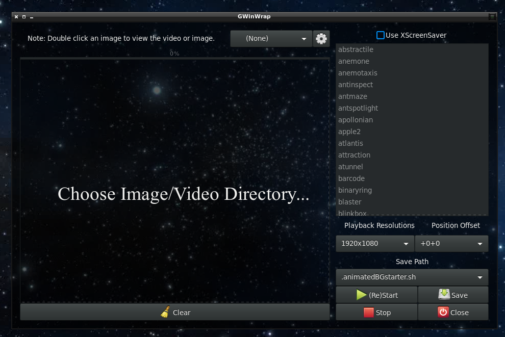
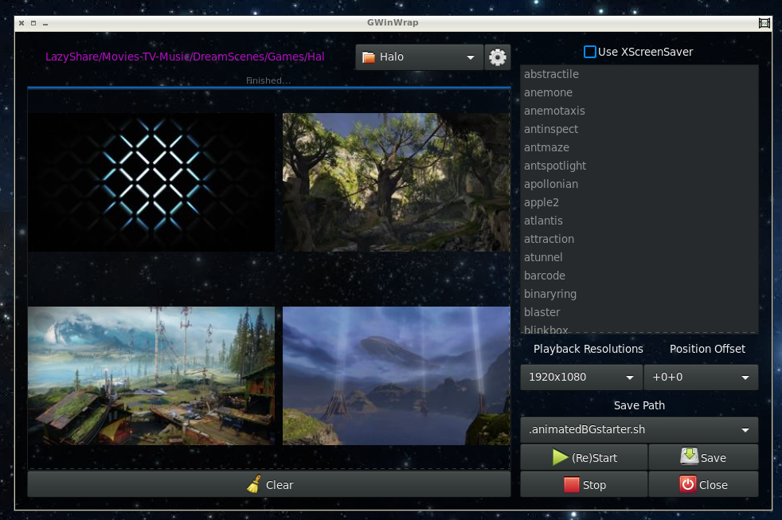
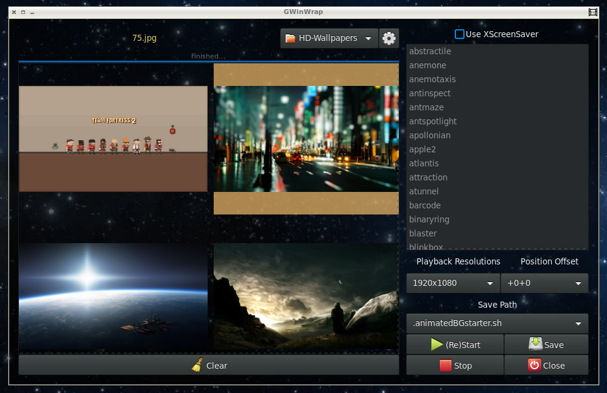
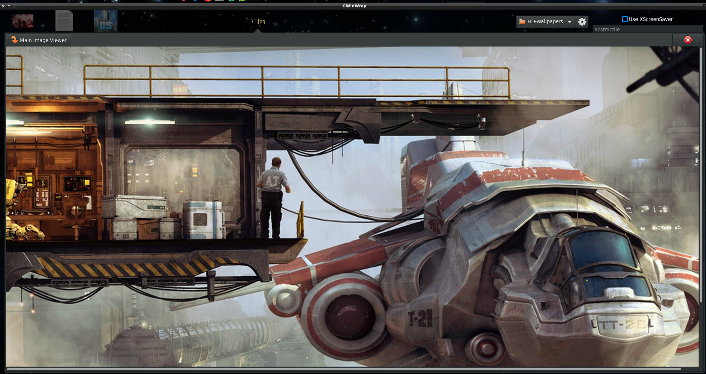
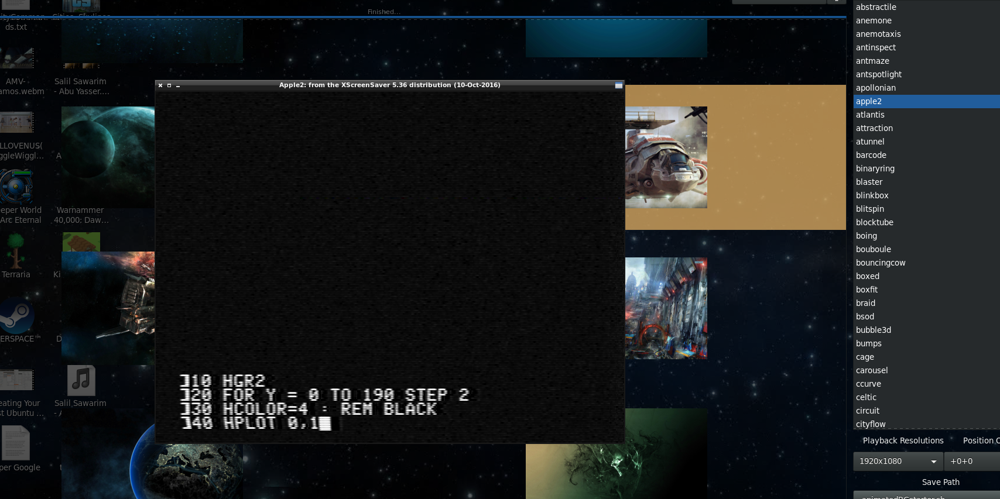

# GWinWrap
GWinWrap is a Gtk with Python gui to select videos for XWinWrap, images for Nitrogen Wallpaper Manager, and gifs for Gifsicle.
It includes the XWinWrap binary and source code for Shantanu Goel's version of XWinWrap.

# Notes
* Need python 2+
* Need PyGObject
* When you first run the application and save settings for a screen, you need to chmod 744 the new file(s) in your $HOME directory.
* A settings file per screen is generated.

# Images

# TODO
* Better/automatic screen detection.
* Run chmod against newly created launch scripts.

# Credit
GWinWrap python and glade by: Maxim Stewart  -- https://www.itdominator.com/
 
XWinWrap binary by: Shantanu Goel -- http://tech.shantanugoel.com
