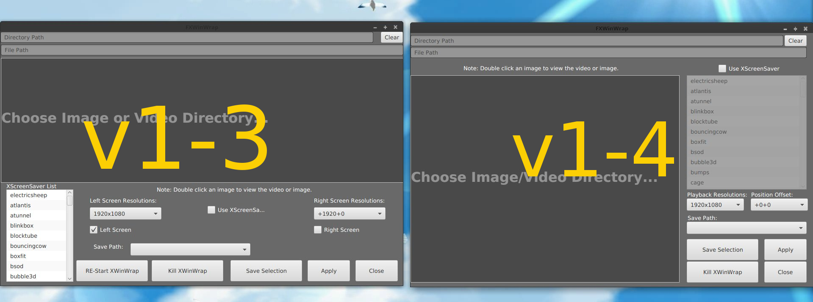
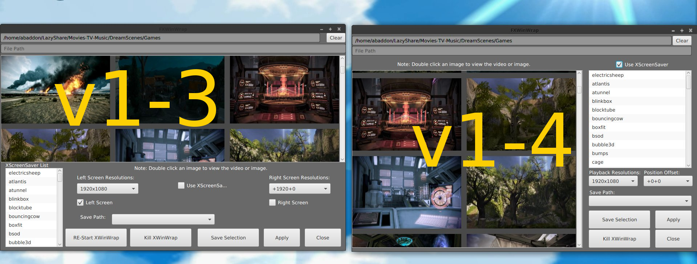

# FXWinWrap
FXXWinWrap is a JavaFX GUI to select videos for XWinWrap, images for Nitrogen Wallpaper Manager, and gifs for Gifsicle.
It includes the XWinWrap binary and source code for Shantanu Goel's version of XWinWrap.

# Notes
v5 introduced the proper Jar structure and reduced some script requirements.

# Images

# TODO
Nothing At This Time

#Credit
FXXWinWrap Java Jar by: Maxim Stewart  -- https://www.itdominator.com/ 
XWinWrap binary by: Shantanu Goel -- http://tech.shantanugoel.com

