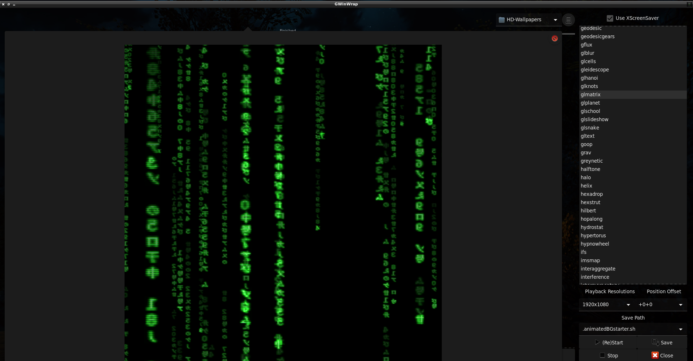

# GWinWrap
GWinWrap is a Python application with a Gtk UI to select videos, gifs (or other images), or an xscreensaver as your desktop wallpaper/background.
This includes the XWinWrap binary and source code from Shantanu Goel's version of XWinWrap.

# Notes
* Need python 2+
* Need PyGObject and Gtk
* A settings file per screen is generated.

# Install
` sudo pacman -Sy mpv gifsicle nitrogen xscreensaver `

# Images

# TODO
* Better/automatic screen detection.

# Credit
GWinWrap python and glade by: Maxim Stewart  -- https://www.itdominator.com/
 
XWinWrap binary by: Shantanu Goel -- http://tech.shantanugoel.com
