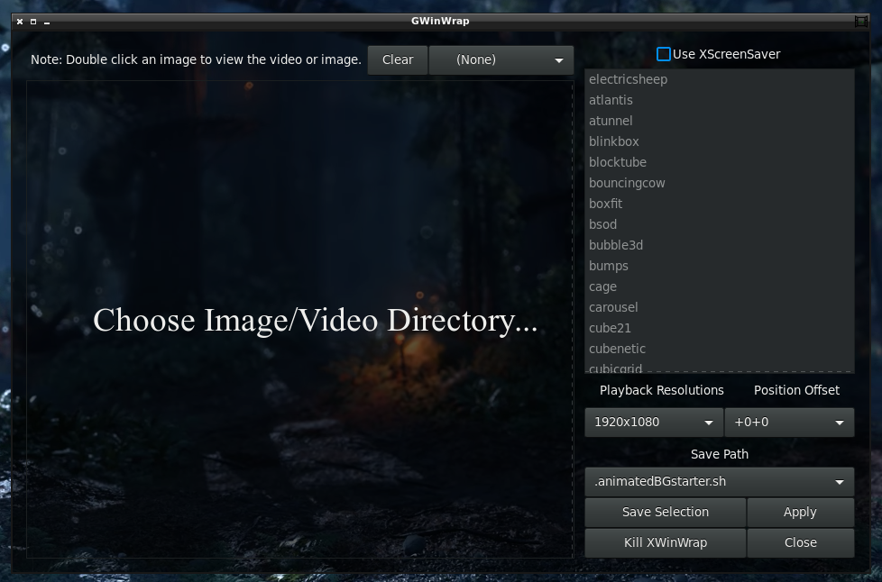
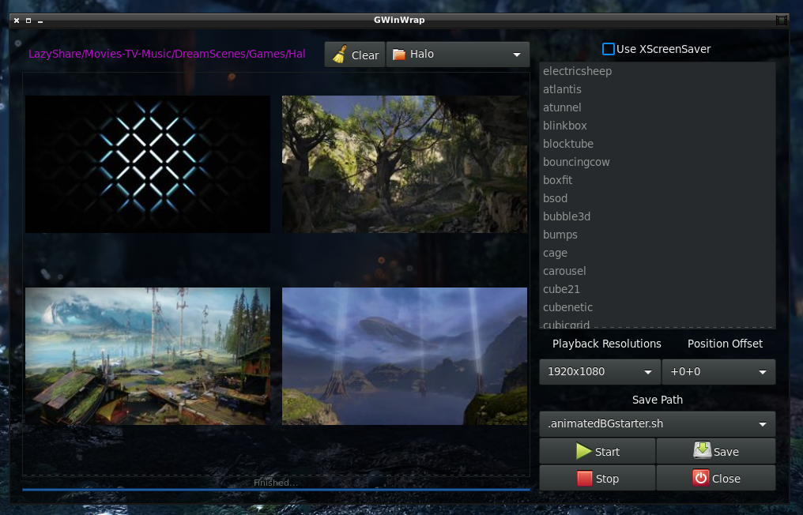
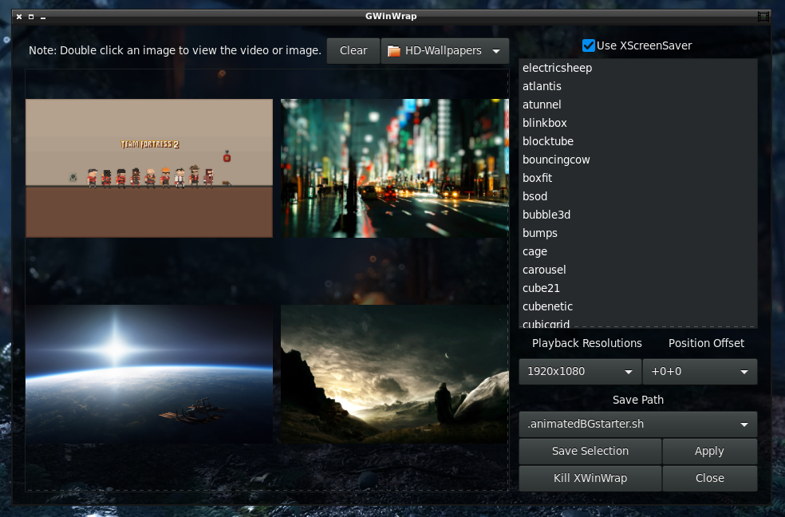
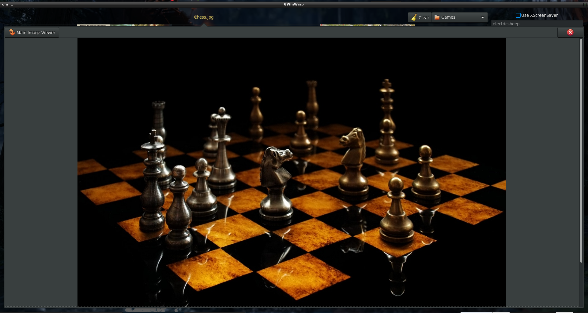

# GWinWrap
GWinWrap is a Gtk with Python gui to select videos for XWinWrap, images for Nitrogen Wallpaper Manager, and gifs for Gifsicle.
It includes the XWinWrap binary and source code for Shantanu Goel's version of XWinWrap.

# Notes
Need python 2+

# Images

# TODO
Nothing...

# Credit
GWinWrap python and glade by: Maxim Stewart  -- https://www.itdominator.com/
 
XWinWrap binary by: Shantanu Goel -- http://tech.shantanugoel.com
